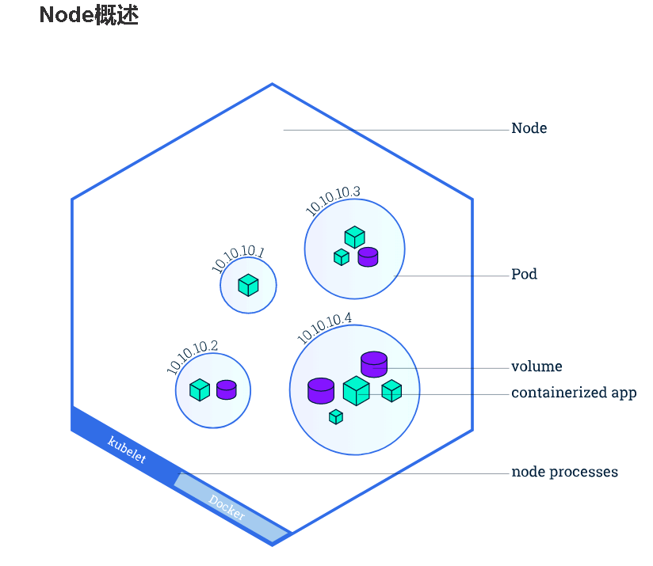

# Kubernetes
## 概念
- Pod 由一个或多个容器组合在一起得共享资源，Pod中的容器共享IP地址和端口。Pod模型是特定应用程序的“逻辑主机”，并且包含紧密耦合的不同应用容器。Pod是Kubernetes中的最小单位，当在Kubernetes上创建Deployment时，该Deployment将会创建具有容器的Pods（而不会直接创建容器），每个Pod将被绑定调度到Node节点上，并一直保持在那里直到被终止（根据配置策略）或删除。在节点出现故障的情况下，群集中的其他可用节点上将会调度之前相同的Pod。
    - 共享网络
    - 网络，唯一的集群IP地址
    - 每个容器运行的信息，例如：容器镜像版本

- Node 一个Pod总是在一个（Node）**节点**上运行，Node是Kubernetes中的工作节点，可以是**虚拟机**或**物理机**。每个Node由 Master管理，Node上可以有多个pod，Kubernetes Master会自动处理群集中Node的pod调度，同时Master的自动调度会考虑每个Node上的可用资源。

    每个Kubernetes Node上至少运行着：

- Kubelet，管理Kubernetes Master和Node之间的通信; 管理机器上运行的Pods和containers容器。
  - container runtime（如Docker，rkt）。
    
    

- Node Controller 节点控制器（Node Controller）是管理节点的Kubernetes master组件。

kubernetes service 中port、target port、node port的对比分析，以及kube-proxy代理
- port: 暴露在集群内部的端口
- target port: pod上的端口，从外部来的数据经过该端口到达Container
- node port: 暴露给外部集群的端口
- kube-proxy： 从port和node port过来的数据经过kube-proxy反向代理，进入target port。
  

常用命令
- Pod
1. `kubectl get pod -n kube-system`  
2. `kubectl describe pod kube-dns-8469565cb5-ljtsx -n kube-system`

- Deployment
1. `kubectl create -f https://kubernetes.io/docs/user-guide/nginx-deployment.yaml`
 - 根据yaml文件创建一个deploment
2. `$ kubectl get deployments`
 - 查看deploments列表
3. 

kubectl controls the Kubernetes cluster manager. 

Find more information at: https://kubernetes.io/docs/reference/kubectl/overview/

Basic Commands (Beginner):
  create         Create a resource from a file or from stdin.
  expose         使用 replication controller, service, deployment 或者 pod 并暴露它作为一个 新的
Kubernetes Service
  run            在集群中运行一个指定的镜像
  set            为 objects 设置一个指定的特征
  run-container  在集群中运行一个指定的镜像. This command is deprecated, use "run" instead

Basic Commands (Intermediate):
  get            显示一个或更多 resources
  explain        查看资源的文档
  edit           在服务器上编辑一个资源
  delete         Delete resources by filenames, stdin, resources and names, or by resources and label selector

Deploy Commands:
  rollout        Manage the rollout of a resource
  rolling-update 完成指定的 ReplicationController 的滚动升级
  scale          为 Deployment, ReplicaSet, Replication Controller 或者 Job 设置一个新的副本数量
  autoscale      自动调整一个 Deployment, ReplicaSet, 或者 ReplicationController 的副本数量

Cluster Management Commands:
  certificate    修改 certificate 资源.
  cluster-info   显示集群信息
  top            Display Resource (CPU/Memory/Storage) usage.
  cordon         标记 node 为 unschedulable
  uncordon       标记 node 为 schedulable
  drain          Drain node in preparation for maintenance
  taint          更新一个或者多个 node 上的 taints

Troubleshooting and Debugging Commands:
  describe       显示一个指定 resource 或者 group 的 resources 详情
  logs           输出容器在 pod 中的日志
  attach         Attach 到一个运行中的 container
  exec           在一个 container 中执行一个命令
  port-forward   Forward one or more local ports to a pod
  proxy          运行一个 proxy 到 Kubernetes API server
  cp             复制 files 和 directories 到 containers 和从容器中复制 files 和 directories.
  auth           Inspect authorization

Advanced Commands:
  apply          通过文件名或标准输入流(stdin)对资源进行配置
  patch          使用 strategic merge patch 更新一个资源的 field(s)
  replace        通过 filename 或者 stdin替换一个资源
  convert        在不同的 API versions 转换配置文件

Settings Commands:
  label          更新在这个资源上的 labels
  annotate       更新一个资源的注解
  completion     Output shell completion code for the specified shell (bash or zsh)

Other Commands:
  api-versions   Print the supported API versions on the server, in the form of "group/version"
  config         修改 kubeconfig 文件
  help           Help about any command
  plugin         Runs a command-line plugin
  version        输出 client 和 server 的版本信息
