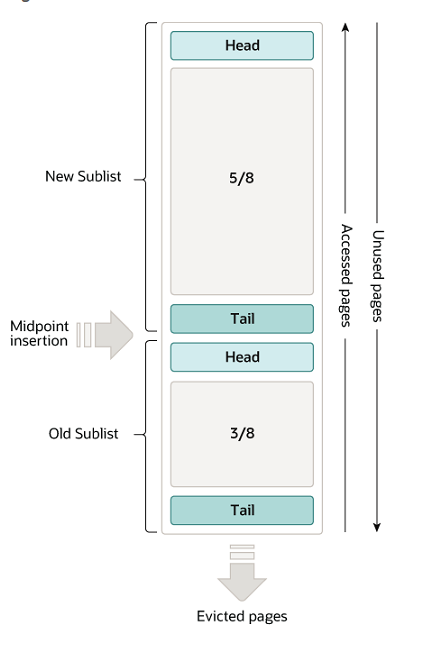
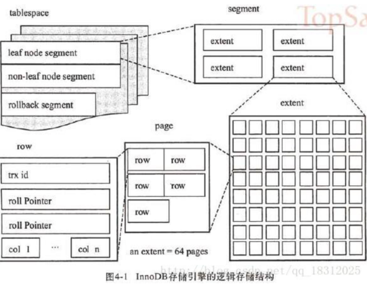

# MySQL学习笔记 

本章节内容主要是针对InnoDB存储引擎进行介绍，其他存储引擎，例如MyISAM等不在此章节讨论范围内。

## 缓冲池 vs 数据页 vs 表空间 vs 段 vs 区 vs 数据行

### [缓冲池（Buffer pool）](https://dev.mysql.com/doc/refman/5.7/en/innodb-buffer-pool.html)

**缓冲池**是主存中的一个区域，InnoDB 在访问时缓存表和索引数据。缓冲池允许直接从内存访问频繁使用的数据，加快处理速度。在数据库专用服务器上，高达80% 的物理内存通常分配给缓冲池。



当 InnoDB 将一个页面读入缓冲池时，它首先将其插入到中点（Midpoint Insertion）(旧子列表的头部)。比如用户发起的操作(如 SQL 查询)所必需的，或者 InnoDB 自动执行的预读操作的一部分。随着数据库的运行，频繁访问的数据由缓冲池中old sublist移动到列表的head部，再移动到new sublist中。新旧子列表（new-old sublist）中的页面都会随着其他页面的更新而老化。旧子列表(old sublist)中的页面也会随着页面插入到中点而变老。最终，一个未使用的页面到达旧子列表的尾部并被驱逐。


### 表空间 vs 段 vs 区 vs 页 vs 数据行

表空间、段、区、页、数据行均是占用的磁盘空间，如下图所示，说明了表空间 vs 段 vs 区 vs 页 之间的关系。




**数据行**：从上图可见，数据行是构成数据页必不可少的一种数据结构。数据库中的每行数据按照某一种行格式存储某一种文件格式中，同时以该种文件格式存储在磁盘中。

**[行格式](https://dev.mysql.com/doc/refman/5.7/en/innodb-row-format.html) vs [文件格式](https://dev.mysql.com/doc/refman/5.7/en/innodb-file-format.html)**

MySQL 5.1 以后的版本，支持2种文件格式`Antelope`（羚羊）、`Barracuda`（梭鱼）。4种行格式：`REDUNDANT`、`COMPACT`、`DYNAMIC`、`COMPRESSED`。

一个表可以指定一个行是以什么样的格式进行存储，例如如下代码：

```sql
CREATE TABLE customer (
name VARCHAR(10) NOT NULL, address VARCHAR(20),
gender CHAR(1),
job VARCHAR(30),
school VARCHAR(50)
) ROW_FORMAT=COMPACT;
```

每种文件格式又支持一种或者多种行格式，如下表所示：

|行格式	|紧凑的存储特性	|增强的可变长度列存储	|大索引键前缀支持|	压缩支持|	支持的表空间类型|	所需文件格式|
|-----|-----|-----|-----|-----|-----|-----|
|REDUNDANT|	不|	不|	不|	不|	系统，每表文件，一般|	羚羊或梭鱼|
|COMPACT|	是的|	不|	不	|不|	系统，每表文件，一般	|羚羊或梭鱼|
|DYNAMIC|	是的|	是的|	是的|	不|	系统，每表文件，一般|	梭鱼|
|COMPRESSED|	是的|	是的|	是的|	是的|	每表文件，一般|	梭鱼|

参考文章: [《数据行结构和行溢出机制》](https://alsritter.icu/posts/d2ad62f9/)

**数据页（page）**：数据库从磁盘中读取数据的最小单位是数据页，但数据页里不是一行一行的数据，其实一个数据页包含了下面的部分：文件头，数据页头，最大最小记录，多个数据行和空闲区域，最后是数据页目录和文件尾部。数据页中包含的数据行越多，在查询和索引时速率越快，同时占用的buffer pool 和 I/O 资源越少。

数据页的写入原理：我们前面提到，数据库从磁盘读取的最小单位是数据页，（假设按聚簇索引顺序写入）将目标页加载到（[InnoDB 数据页解析](http://mysql.taobao.org/monthly/2018/04/03/)）buffer pool中。当遇到insert语句时，直接将数据写入到buffer pool加载后的数据页中(此时，并没有刷盘持久化，为了避免server宕机导致的buffer pool 数据丢失，数据库提供了redo log和binlog机制)，写入到数据页的数据根据聚集索引排列的，根据聚簇索引，在满足一个数据页存储的容量（16K）情况下，相邻的行数据存储在同一数据页中。针对页分裂，本部分不做介绍（当行的主键值要求必须将这一行插入到某个已满的页中时，存储引擎会将该页分裂成两个页面来容纳该行，这就是一次分裂操作。页分裂会导致表占用更多的磁盘空间）。


**数据区(extent)**：一个数据区对应64个数据页，就是16kb，一个数据区是1mb，256个数据区被划分为一组，对于表空间而言，他的第一组数据区的第一个数据区的前3个数据页，都是固定的，里面存放了一些描述性的数据。比 如FSP_HDR这个数据页，他里面就存放了表空间和这一组数据区的一些属性。IBUF_BITMAP 数据页，存放的就是insert buffer的信息，INODE 数据页存放的也是特殊信息。

**数据段(segment)**：段(Segment)分为索引段，数据段，回滚段等。其中索引段就是非叶子结点部分，而数据段就是叶子结点部分，回滚段用于数据的回滚和多版本控制。一个段包含256个区(256M大小)。​ 一个段包含256个区

**表空间(tablespace)**：为磁盘空间一组逻辑上的空间区域。 当我们创建一个表之后，在磁盘上会有对应的表名称.ibd的磁盘文件。表空间的磁盘文件里面有很多的数据页，一个数据页最多16kb，因为不可能一个数据页一个磁盘文件，所以数据区的概念引入了。每个表空间就是对应了磁盘上的数据文件，在表空间里有很多组数据区，一组数据区是256个数据区， 每个数据区包含了64个数据页，是1mb  

