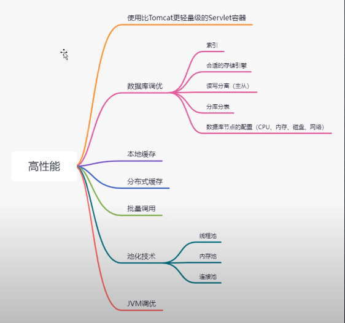
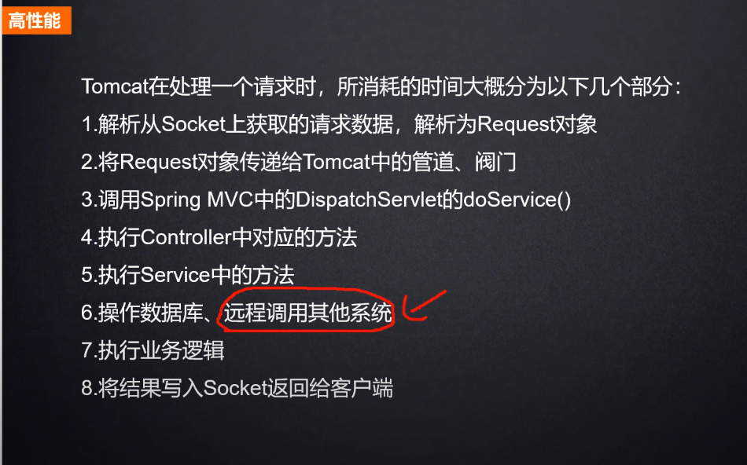

# 高性能

## 高性能优化方案

## 数据库IO优化

## 异步
`stopWatch.start()` 和 `stopWatch.stop()`
- 线程池
- 内存池：Buffer pool、ArrayList
- 连接池：数据库连接、Socket连接

## 加缓存
### 本地缓存 vs Redis缓存
- Map、Set、List
- Guava Cache
- Caffeine
